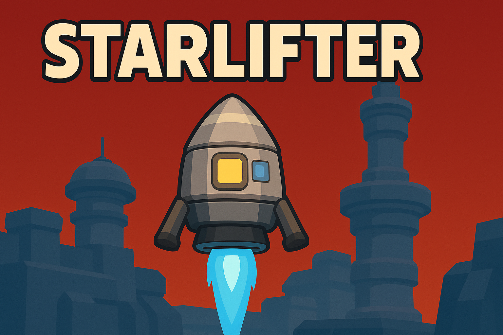
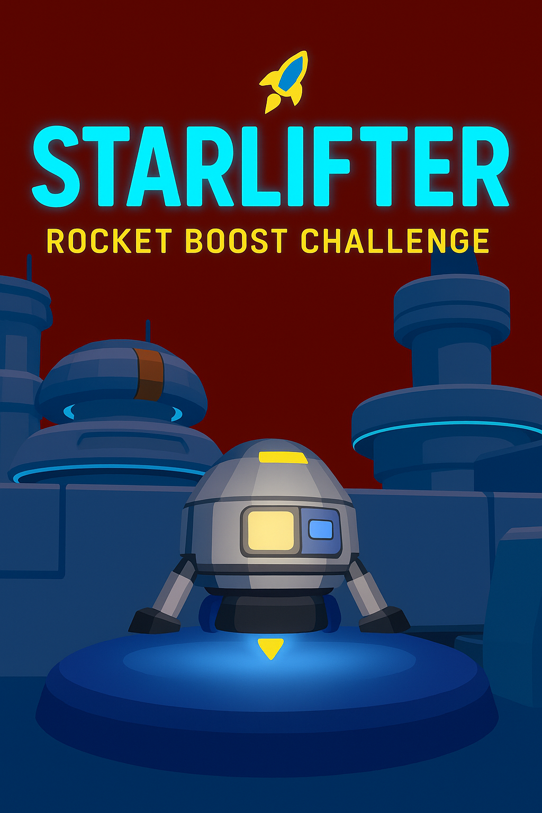
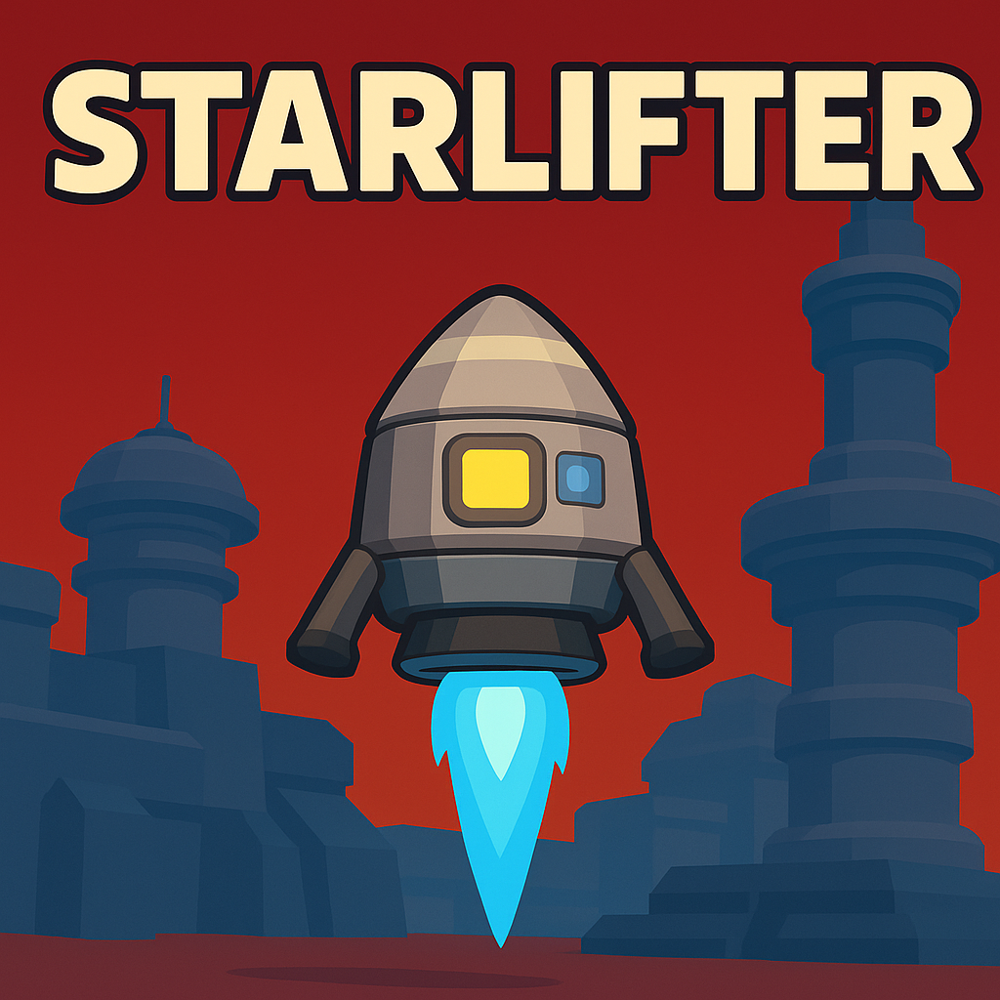

# 🖼️ Banner

Upload a 1920×480 (or similar) banner image of your rocket on a landing pad with glowing towers behind it. Include the title “Starlifter: Rocket Boost Challenge” in bold, rounded sans-serif font with neon blue outline and a small yellow thruster flame icon above the “i”.

---

# 📄 Itch.io Page Template

## 📝 Title

**Starlifter: Rocket Boost Challenge**

## ✨ Tagline

*“Precision thrust. Perfect landings. Beat the hazards.”*

## 🗒️ About This Game

**Starlifter: Rocket Boost Challenge** is a physics-driven arcade skill game built in Unity 6 as part of the GameDev.tv “Rocket Boost” section.
Pilot a small lander through increasingly tricky hazards and moving platforms to reach the landing pad. It’s 2.5D with a clean, low-poly sci-fi look.

* Rotate left/right and thrust upwards using **keyboard or gamepad**.
* Master **momentum and collisions** to avoid hazards.
* Navigate sequential levels of **increasing difficulty**.
* Enjoy snappy **particle and audio feedback** for every action.

Built for browsers – no download needed.

---

## 🎮 Controls

| Action         | Keyboard          | Gamepad (default)  |
| -------------- | ----------------- | ------------------ |
| Thrust Upwards | `Space` or `W`    | `A / Cross` button |
| Rotate Left    | `A` / Left Arrow  | Left Stick Left    |
| Rotate Right   | `D` / Right Arrow | Left Stick Right   |
| Pause/Retry    | `Esc`             | `Start` button     |

*(Customize the key map to your Input System setup before publishing.)*

---

## 🚀 Features

* Tight, physics-based controls.
* Bright, low-poly sci-fi environments.
* Particle effects, audio feedback, and camera polish.
* Local high scores & star ratings per level (post-course “juice”).
* Unlockable rocket skins & limited fuel mode for extra challenge (planned).

---

## 📸 Screenshots / GIFs

* [Upload 3–5 screenshots] showing your rocket mid-thrust, a hazard, a safe landing.
* [Optional GIF] of a full landing sequence.

---

## 🧑‍💻 Credits

Use Credits from ReadMe

---

## 📥 How to Play

Click “Run Game” to play in your browser. No installation required.
*(Add PC download link here if you’re providing an offline build.)*

---

## 📝 Version History

* **v1.0** – Base course project.
* **v1.1+** – Added “juice” features (fuel, skins, scoring).

---

### 🧩 Tip

If you use the exact wording above, just replace the italicized parts (`*[Your Name]*`) with your name or studio, and adjust controls if you remap them.
